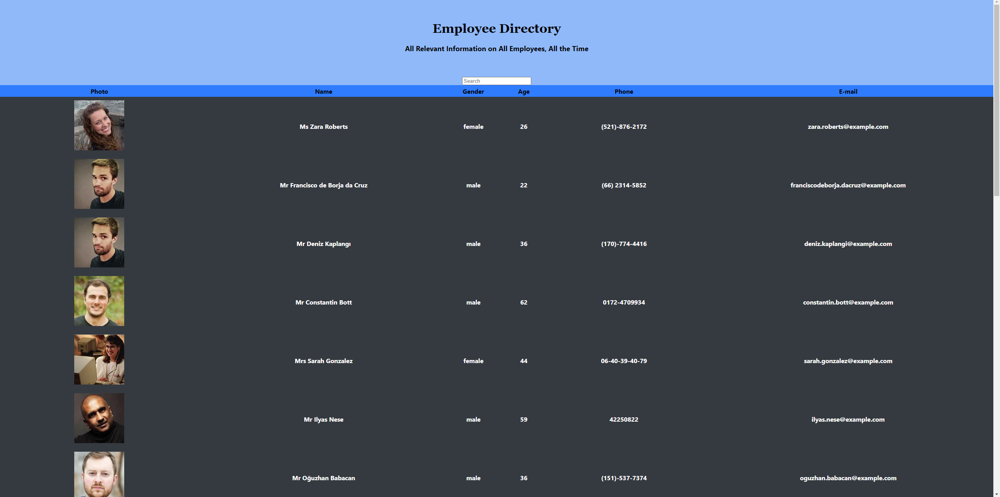

# **Employee Directory**

## Description 
An employee or manager would benefit greatly from being able to view non-sensitive data about other employees. It would be particularly helpful to be able to filter employees by name.

### Example imgage

## Table of contents
- [Description](#Description)
- [Licence](#Licence)
- [Contributors](#Contributors)
- [Test](#Test)
- [Repository Link](#Repository)
- [Heroku Link](#heroku)
- [GitHub Info](#GitHub) 

## Licence

## Contributors
Just me Jordan Kirby

## Test
no test

## Repository
- [Employee Directory](https://github.com/Feizhi255/employee-directory)

## heroku
- [heroku link](https://sheltered-sands-79144.herokuapp.com/)
## GitHub

- Jordan Kirby
- [Feizhi255](https://github.com/Feizhi255)
## Questions? send me an email title it with the Repo name plz
- <jrock255@hotmail.com>